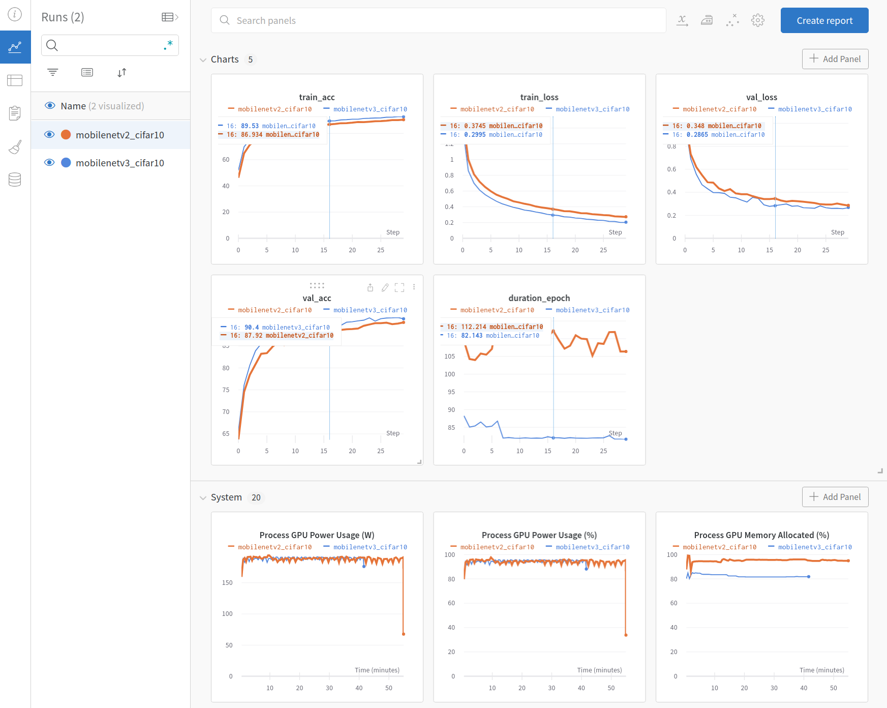

# Miyagi's Pytorch Trainer

A pytorch trainer with a range of choice for backbones, losses, augmentations. And wandb tracking and sweeps!


# Features

- Easy to use for your own datasets, based on [`torchvision.datasets.ImageFolder`](https://pytorch.org/vision/stable/generated/torchvision.datasets.ImageFolder.html), supports multiple combinations and pre-existing [datasets from Pytorch](https://pytorch.org/vision/stable/datasets.html);
- Several backbones available, based on the awesome [`timm`](https://github.com/rwightman/pytorch-image-models);
- Losses are a mix from what you can find in the official Pytorch and  [Pytorch Metric Learning](https://github.com/KevinMusgrave/pytorch-metric-learning);
- Experiments can be tracked with [Weight & Biases](https://wandb.ai/) and sweeps are integrated, check the section about that;

# How to use

## Quickstart

1. Create and activate the conda environment (it should take a few minutes):

```
conda env create --name miyagi --file=environment.yml
conda activate miyagi
```

2. (Optionally) Login in with your [wandb](https://wandb.ai/) account:

```
wandb login
```

3. Run training (ex.: CIFAR10, mobilenet_v3, CE loss):

```
python miyagi_trainer/train.py --resize_size 224 --train_datasets CIFAR10 --val_datasets CIFAR10 --backbone mobilenetv3_large_100
```

That should download everything you need and start running. If you did `2` for sure you're interested in tracking this experiment. For that, set the following args:

```
--track_experiment --experiment_group miyagi-test --experiment_name test1 --wandb_user my_wandb_user
```

## Resizing images

You always need to set a size to resize all your images (that's make easier to accommodate for different datasets).
For that, set the `--resize_size` param, such as `--resize_size 224`.

## Datasets

To have up and running in no time, the trainer support using the [Pytorch official datasets](https://pytorch.org/vision/stable/datasets.html), examples are CIFAR10, MNIST, ImageNet, etc.). Anyone in that list should work fine.
```
--train-datasets CIFAR10 --val-datasets CIFAR10
```

Of course you can also use your own data to train. For that we use the `torchvision.datasets.ImageFolder`. As [per the documentation](https://pytorch.org/vision/stable/generated/torchvision.datasets.ImageFolder.html), you should put your images for each class inside a folder named with that class, ex:


```
custom_dataset_folder
│
└───train
│   │
│   └───class1
│   |       file001.png
│   |       file002.png
│   |       ...
│   └───class2
│           file003.jpg
│           file004.png
│           ...
└───val
    └───class1
    │       file005.jpeg
    ...
```
For reasons that should become clear, you need to chose a name for your custom dataset and put them into the `CUSTOM_DATASETS` dict in [datasets.py](https://github.com/gustavofuhr/miyagi_pytorch_trainer/blob/main/miyagi_trainer/datasets.py):

```
CUSTOM_DATASETS = {
    "custom_dataset": "data/custom_dataset_folder/"
}
```
Then you can reference it by name. Is's always expected that you have a `train` and `val` folder as the primary subfolders in your path (check tree above). You also can combine multiples datasets using `+`, like this:

```
--train-datasets CIFAR10+CIFAR100 --val-datasets CIFAR10
```
I implemented using `+` and a single string because otherwise sweeps will not work for them. A cool thing about this feature is that you can have a dataset that has only a subset of classes from another and it will still work just fine (see [implementation](https://github.com/gustavofuhr/miyagi_pytorch_trainer/blob/4b2b8a93640b41375138b8cba0e80eeaa33f1454/miyagi_trainer/dataloaders.py#L81) for the details)

## Choosing the backbone

The lib uses the 0.5.4 version of the [`timm`](https://github.com/rwightman/pytorch-image-models) package. You can always update to the newest version, if you want it. It also works on [torchvision models](https://pytorch.org/vision/stable/models.html), but, if you choose a backbone that is in both, priority is always given to `timm`. You can control if want a pre-trained model (the default) or don't (`--no_transfer_learning`). You specify a backbone using the following:

```
--backbone mobilenetv3_large_100
```

A nice tip: you can search by the timm backbones easily as well, for example:
```
>>> import timm
>>> timm.list_models("mobilenet*")
['mobilenetv2_035', 'mobilenetv2_050', 'mobilenetv2_075', 'mobilenetv2_100', 'mobilenetv2_110d', 'mobilenetv2_120d', 'mobilenetv2_140', 'mobilenetv3_large_075', 'mobilenetv3_large_100', 'mobilenetv3_large_100_miil', 'mobilenetv3_large_100_miil_in21k', 'mobilenetv3_rw', 'mobilenetv3_small_050', 'mobilenetv3_small_075', 'mobilenetv3_small_100']

```

## Choosing the loss

Since we're dealing with classification problems, cross entropy is the default loss. You also can choose to do label smoothing by setting `--ce_loss_label_smoothing [LABEL SMOOTHING FACTOR]`. The [Pytorch Metric Learning](https://github.com/KevinMusgrave/pytorch-metric-learning) package is also included, right now you can only use the `--loss angular` from it (we should include more in the near future, but if you want it's quite easy to include it in [`losses.py`](https://github.com/gustavofuhr/miyagi_pytorch_trainer/blob/main/miyagi_trainer/losses.py)).

## Choosing the augmentation

We don't use an specific lib for augmentation, but we support some nice ones. You just need to define the `--augmentation` parameter to one of those:

- `no_aug`: resize the image according to the `resize_size` parameter and normalize it;
- `simple`: some crop, flips and rotations;
- `random_erase`: erase parts of the images randomly;
- `rand-m9-n3-mstd0.5`, `rand-mstd1-w0`, etc: RandAugment from timm library. Usually the best option, check the [official doc](https://timm.fast.ai/RandAugment) for details.

## More details and other options


We have a few other options that you can set as well. For a full list just run `python miyagi_trainer/train.py --help`. Here's the most important ones:

- `weight_decay` (default `1e-4`): weight decay is nowdays consider to be a good idea almost always. We set the default, but you could try to find the sweet spot for your problem, you can check [this paper](https://arxiv.org/pdf/2203.14197.pdf) to see for yourself if that is worth doing it.
- `optimizer` (default `sgd`): the optimizer for training, you can also set to `adam` and `adamp`. I usually let it to SGD because we use `CosineAnnealingWarmRestarts` as the LR scheduler by default and I had some problems using other optimizers with that.
- Others: `batch_size` (default `64`), `n_epochs` (default `30`).

# W&B experiment tracking and sweeps

## Track experiment
As mentionned in the quickstart, you have a few option if you want to enable experiment tracking in the trainer, check it out:

- `track_experiment`: this boolean param must be set for enabling experiment tracking;
- `wandb_user`: your user from [Weight & Biases](https://wandb.ai/);
- `experiment_group` (default `miyagi-pytorch-trainer`): that's the name you use to group experiments and compare them, it's the project arg on wandb.init(). [See documentation](https://docs.wandb.ai/guides/track/launch).

Do not forge to run `wandb login` before your experiment. If everything works out, you should have experiment tracking and can analyze your losses and accuracies. Check it out:



That's even an analysis of how much system resource are you using. Also, associated with each experiment
there is all the original configuration used for it.

## Sweeps

Almost every time that you're training a model, you want to try out a bunch of different models, configs, hyperparameters. Wandb sweeps can help you a lot for that and it's quite simple to use. Basically, you need to register a sweep, which defines which options/intervals you want to explore. This info is kept in the cloud and then you can open multiples machines (agents) to run this "queue" of experiments in parallel.

To define the sweeps, you should create an yaml file and run the following command:
```

```

There is some examples in the `sweeps/` folder. Once you done this, you need to run agents in the
machines that you had setup:

```

```


[comment]: <> (# Samples)


